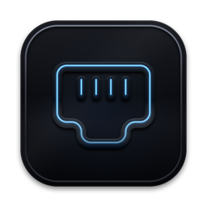

<!-- prettier-ignore -->
<div align="center">




# LocalPort

*Local hostnames for every project. No more port numbers.*

[](https://github.com/HibiZA/LocalPort/releases/latest)
[](https://github.com/HibiZA/LocalPort/actions/workflows/ci.yml)


[](LICENSE)

[**Download**](https://github.com/HibiZA/LocalPort/releases/latest) • [Features](#features) • [Getting started](#getting-started) • [Usage](#usage) • [Configuration](#configuration) • [How it works](#how-it-works)


</div>

LocalPort is a macOS menu bar app that gives each of your local dev servers its own HTTPS hostname, such as `https://myapp.test`. Start a server the way you always do: LocalPort finds its port, routes the hostname to it and trusts the certificate, with no configuration.

```
https://myapp.test     → localhost:3000
https://api.test       → localhost:8080
https://dashboard.test → localhost:5173
```

## Why LocalPort

With several projects open at once (often one per coding agent), `localhost` stops working well:

- You can't tell whether `localhost:3000` is the frontend or the API, or whether an old server still holds the port.
- Cookies, localStorage and sessions leak between projects, because they all share the `localhost` origin.
- OAuth providers can't send callbacks to one port when three apps take turns on it.

A hostname per project gives each one its own origin, a stable URL for OAuth redirects (`https://myapp.test/callback`) and real HTTPS.

## Features

- **Zero config.** Add a project folder once. LocalPort detects its dev server from the listening ports and routes `project.test` to it.
- **Automatic HTTPS.** Caddy serves every hostname with a certificate from a local authority that your Mac trusts.
- **Dev servers from the menu bar.** Start and stop a project's server. LocalPort finds the command (`pnpm run dev`, `bin/rails server`, `cargo run`…) and runs it with your shell's PATH.
- **Live resource usage.** CPU, GPU, memory and network for every server.
- **Monorepo aware.** `localport run` tags a server with its project, so attribution is exact whatever the working directory.
- **Docker friendly.** Assign a published port to a project, whichever process listens on it.
- **Works with your tools.** Open a project in your browser or editor (VS Code, Cursor, Zed, JetBrains IDEs and others) in one click.
- **Updates itself.** Signed updates with [Sparkle](https://sparkle-project.org).

## Getting started

### Install

Download `LocalPort.dmg` from the [latest release](https://github.com/HibiZA/LocalPort/releases/latest), open it and drag LocalPort to Applications.

> [!IMPORTANT]
> LocalPort is not notarized yet. On first launch, macOS blocks it as an app from an unidentified developer. Open **System Settings → Privacy & Security** and click **Open Anyway**.

On first launch, LocalPort sets up your Mac with two prompts:

1. **Your password**, to add DNS resolution for `*.test` and forward ports 80 and 443 to Caddy (47080 and 47443). The forwarding is applied again at boot and after macOS updates.
2. **A macOS dialog to change Certificate Trust Settings**, so browsers trust LocalPort's certificate authority. macOS accepts this change only from an app with a window on screen, so it can't be part of the password prompt.

If Caddy isn't installed, LocalPort downloads a pinned, checksum-verified release. It checks this setup at every launch and asks again only if something is missing, for example after you change the TLD or ports.

### Add your first project

1. Click the LocalPort icon in the menu bar, then **Add Project…** (⌘N).
2. Select the project folder.
3. Start the dev server as usual:

   ```bash
   cd ~/projects/my-app
   npm run dev
   ```

4. Open `https://my-app.test`.

## Usage

### The popover

Click the menu bar icon to open the popover. It has three tabs (⌘1–⌘3):

- **Projects:** your projects with their URL and status. Click a project to open it in your browser.
  - Hover a row for **Start/Stop**, **Copy URL**, **Open in editor** and **Open**, and a pencil that renames the URL in place.
  - The **•••** menu adds **Show Output**, **Reveal in Finder**, **Pin to Top** and **Settings…**, and shows which process serves the project.
  - Drag a row to reorder it. Pinned projects show in their own section on top.
- **Ports:** every server LocalPort sees, with its [resource usage](#resource-usage): project servers, other routes (such as `localport run` servers for projects you haven't added) and unclaimed ports.
- **System:** the state of the daemon and the HTTPS proxy (with the error if the proxy failed), the TLD, **Open Logs** and **Check for Updates…**.

**Unclaimed ports** are dev servers that LocalPort sees but can't match to a project. From a port's **•••** menu, add its folder as a project, or **Assign to Project** to route the port to an existing project whichever process listens on it. Use **Assign** for servers outside the project folder, such as a Docker-published port.

### Dev servers

Hover a project and click ▶ (or use **Start Dev Server** in its **•••** menu). LocalPort runs the command:

- in the project folder, with the PATH your terminal has (Homebrew, nvm, asdf…)
- tagged with `LOCALPORT_PROJECT`, so its port goes to the project even in a monorepo
- in its own process group, so **Stop** also ends the processes it starts (npm → node → esbuild)

The row shows **Starting…** until the server listens, then its port, or **Exited** with the exit code if it fails. **Show Output** opens its log (`~/Library/Logs/LocalPort/projects/<name>.log`). Quitting LocalPort stops the servers it started.

LocalPort finds the command from the project's files: the `dev`, `start` or `serve` script in `package.json` (with npm, pnpm, yarn or bun, from `packageManager` or the lockfile), `bin/dev`, `bin/rails server`, `manage.py runserver`, `mix phx.server`, `cargo run`, `go run .` or `docker compose up`. Set a different **Start command** in the project's **Settings…**.

### Resource usage

The Ports tab shows these figures for the process that holds each listening socket:

| | Source |
|---|---|
| **CPU** | CPU time from `proc_pid_rusage`, as a share of one core (can pass 100% on several cores) |
| **GPU** | GPU time that macOS records per process, the source Activity Monitor uses |
| **MEM** | Physical memory footprint, the figure Activity Monitor shows as Memory |
| **NET** | Bytes per second in (↓) and out (↑), from a one-second `nettop` sample |

CPU and GPU turn amber above one busy core and red above two. LocalPort samples every 2 seconds, and only while the Ports tab is open. No extra permissions are necessary.

> [!NOTE]
> The figures cover the listening process only, not the workers it starts. For a Docker-published port, that process is Docker's helper, not the container.

### Monorepos and `localport run`

LocalPort normally matches a server to a project by its working directory. In a monorepo, servers often start from the repository root, so the match fails or goes to the wrong project. Wrap the command in `localport run` to tag it:

```bash
localport run --project web -- pnpm --filter web dev
# → https://web.test, from any directory
```

`localport run` sets `LOCALPORT_PROJECT` and runs your command. Child processes inherit the variable, so the worker that ends up holding the socket (Vite, Next, esbuild…) still has the tag. A tag always wins over the working directory. Without `--project`, the name comes from the nearest `.localport.toml`, else the current directory's name.

The CLI is inside the app. To put it on your `PATH`:

```bash
sudo ln -sf /Applications/LocalPort.app/Contents/Helpers/localport /usr/local/bin/localport
```

### Settings

Open **Settings** from the popover (⌘,):

- **General:** launch at login, the browser and the editor that open projects, notifications when a project starts or stops, and updates.
- **Network:** the TLD, whether to list unclaimed ports, and the HTTP, HTTPS and DNS ports. Changing ports restarts the daemon and asks for your password once.
- **Certificate:** whether your Mac trusts LocalPort's certificate authority, with **Trust Certificate…** if it doesn't.
- **Advanced:** the log level, restart the daemon, run setup again, open the logs or `config.toml`, and uninstall.

Each project also has its own **Settings…**: name, colour, URL, start command and port.

### Updates

LocalPort checks for updates once a day. When it finds one, the popover header shows the new version. Click it to read the release notes and install, or turn on **Download and install updates automatically** in **Settings → General** to install when you quit. LocalPort installs only updates signed with the key built into the app.

> [!NOTE]
> Versions before 0.3.0 can't update themselves. Download the latest release once by hand.

## Configuration

### Global config

`~/.config/localport/config.toml`:

```toml
tld = "test"          # hostname suffix

[caddy]
http_port = 47080     # uncommon ports, so they don't collide with your dev servers
https_port = 47443
admin_port = 47019    # Caddy admin API, localhost only

[daemon]
log_level = "info"
dns_port = 5553
```

**Settings** edits this file and restarts the daemon for you.

> [!TIP]
> Set `tld = "localhost"` to skip the DNS setup: browsers resolve `*.localhost` themselves. Projects are then at `http://myapp.localhost:47080`.

### Per-project config

A `.localport.toml` in a project's root overrides the defaults. Every field is optional.

```toml
[project]
name = "my-app"       # default: the folder name
hostname = "my-app"   # a bare label gets the TLD; "api.my-app.test" is used as-is
port = 5173           # route only this port
```

Hostname and port set in the project's **Settings…** take precedence over the file. When a project listens on several ports, LocalPort routes the lowest one, skipping Node's inspector (9229) and ephemeral ports. Set `port` to choose.

### Logs

The daemon and Caddy log to `~/Library/Logs/LocalPort/` (**System → Open Logs**). If the proxy fails, the popover shows the error and LocalPort restarts it.

## How it works

```
Browser → https://myapp.test
    → DNS resolver (/etc/resolver/test → 127.0.0.1:5553)
    → pf port forwarding (443 → 47443)
    → Caddy reverse proxy (HTTPS from a local CA)
    → your dev server (localhost:3000), found by the port watcher
```

| Component | Language | Role |
|---|---|---|
| `LocalPort.app` | Swift | Menu bar app: UI, daemon supervision, system setup, dev servers, resource usage, updates |
| `localportd` | Rust | Daemon: port watcher, Caddy management, DNS responder, IPC |
| `localport` | Rust | CLI: `localport run` tags a server with its project |
| Caddy | Go | Reverse proxy with automatic HTTPS (downloaded if missing) |

The daemon scans listening TCP ports every 2 seconds with macOS `libproc` calls (no subprocesses) and matches each port to a project, in this order:

1. **Assigned port.** A port assigned to a project always routes to it, whichever process listens.
2. **Tag.** A `LOCALPORT_PROJECT` variable in the process's environment (from `localport run` or a dev server LocalPort started) names the project.
3. **Working directory.** The process runs inside a registered project folder. With nested folders, the most specific one wins.

Each project gets one route, to the exact address the server listens on, so servers bound only to IPv6 `::1` work too. When the port stops listening, the route goes away.

## Development

You need macOS 13 or later, a Rust toolchain and Swift 5.9 or later (Xcode for universal builds).

```bash
git clone https://github.com/HibiZA/LocalPort.git
cd LocalPort
bash scripts/build.sh            # build/LocalPort.app (--universal, --dmg)
cp -r build/LocalPort.app /Applications/
```

CI runs `cargo fmt --check`, `cargo clippy --all-targets -- -D warnings`, `cargo test` and `swift build` in `macos/`.

### Releasing

Push a `v*` tag. The release workflow tests, builds the universal app and DMG, and publishes a GitHub release with the Sparkle update (`LocalPort.zip` and `appcast.xml`).

```bash
git tag -a v1.2.3 --cleanup=verbatim -F notes.md
git push origin v1.2.3
```

The tag's message becomes the release notes on GitHub and in the update dialog. `--cleanup=verbatim` keeps `## ` headings, which git otherwise drops as comments.

> [!IMPORTANT]
> The workflow signs updates with the `SPARKLE_PRIVATE_KEY` repository secret, the private half of `SUPublicEDKey` in `macos/Resources/Info.plist`. Without it, the release is published but installed apps aren't offered it. To test locally, `scripts/make-appcast.sh` signs with the key in your login keychain.

## Uninstall

**Settings → Advanced → Uninstall LocalPort…** removes the DNS resolver, the port forwarding, the trusted certificate authority, LocalPort's data and logs, and the app. Removing the certificate trust shows a macOS dialog, in addition to the password prompt.
