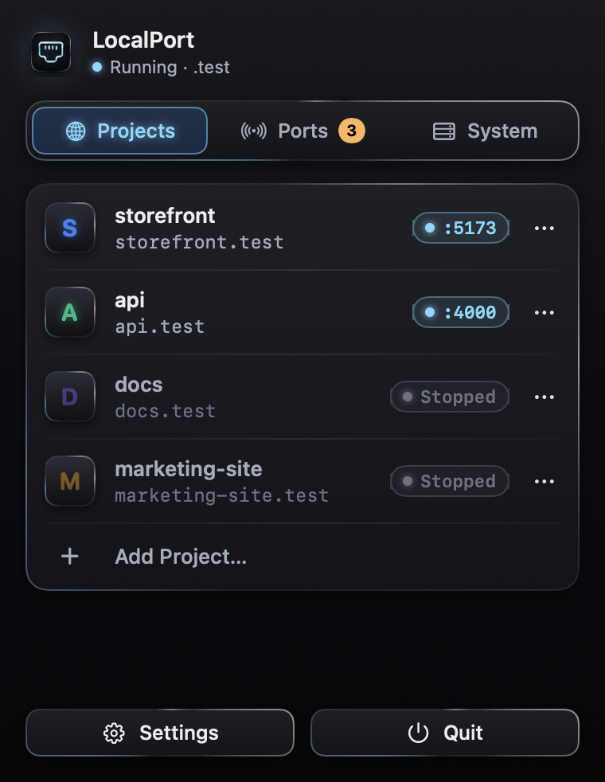

<p align="center">
  
  <h1 align="center">LocalPort</h1>
  <p align="center">Local hostnames for every project. No more port numbers.</p>
</p>

<p align="center">
  <a href="https://github.com/HibiZA/LocalPort/releases/latest"></a>
  <a href="https://github.com/HibiZA/LocalPort/blob/master/LICENSE"></a>
  
  
  
  <a href="https://github.com/HibiZA/LocalPort/stargazers"></a>
  <a href="https://github.com/HibiZA/LocalPort/issues"></a>
</p>

<p align="center">
  <a href="https://github.com/HibiZA/LocalPort/releases/latest"><strong>Download</strong></a> &nbsp;&middot;&nbsp;
  <a href="#install">Install</a> &nbsp;&middot;&nbsp;
  <a href="#how-it-works">How It Works</a> &nbsp;&middot;&nbsp;
  <a href="#configuration">Configuration</a>
</p>

---

## The Problem

AI coding agents have changed how developers work. Tools like Claude Code, Cursor, and Codex make it easy to spin up and iterate on multiple projects at once — you might have an agent building a frontend in one terminal, another scaffolding an API, and a third prototyping a microservice, all running simultaneously.

But your local environment wasn't built for this. You end up with:

- `localhost:3000` — is that the frontend or the API?
- `localhost:3001` — which project was this again?
- `localhost:8080` — did I already kill the old server?

Cookies and localStorage bleed across projects because they all share the `localhost` origin. OAuth redirect URIs become a mess — you can't tell Google "send auth callbacks to `localhost:3000`" when three different apps are fighting over that port. The more projects you run in parallel, the worse it gets.

## The Solution

LocalPort gives each project its own hostname:

```
https://myapp.test     → localhost:3000
https://api.test       → localhost:8080
https://dashboard.test → localhost:5173
```

- **Unique browser origins** — cookies, localStorage, and sessions are isolated per project
- **Clean OAuth redirects** — configure `https://myapp.test/callback` in Google Console
- **No port memorization** — just use the project name
- **Auto-HTTPS** — Caddy handles TLS with an internal CA
- **Zero config** — start your dev server, LocalPort detects it automatically

## How It Works

1. Add a project from the menu bar (click the LocalPort icon → **Add Project…**)
2. Start your dev server however you normally do
3. LocalPort auto-detects the listening port and maps it to `yourproject.test`
4. Open `https://yourproject.test` in your browser

The menu bar app shows which projects are running, on which ports, and what they cost in CPU, GPU, memory and network:

<p align="center"></p>

## Install

### Download

Grab the latest `.dmg` from [**Releases**](https://github.com/HibiZA/LocalPort/releases/latest), open it, and drag LocalPort to Applications.

On first launch, macOS will show an "unidentified developer" warning. Go to **System Settings → Privacy & Security** and click **Open Anyway**.

### Build from Source

```bash
git clone https://github.com/HibiZA/LocalPort.git
cd LocalPort
bash scripts/build.sh
cp -r build/LocalPort.app /Applications/
```

### First Launch

On first launch LocalPort sets up your Mac with two prompts:

1. **Your password**, to set up DNS resolution for `*.test` domains and port forwarding (80 → 47080, 443 → 47443). The forwarding is re-applied automatically at boot and after macOS updates.
2. **A macOS dialog to change Certificate Trust Settings**, so browsers trust LocalPort's local certificate authority for HTTPS. macOS only lets an app with a window on screen change trust settings, so this can't be part of the password prompt.

If Caddy isn't installed, a pinned, checksum-verified release is downloaded automatically. LocalPort checks this configuration on every launch and asks again only if something is missing (for example after you change the TLD or ports). You can also re-run either step from **Settings → Advanced** and **Settings → Certificate**.

## Usage

1. Click the LocalPort icon in the menu bar → **Add Project…**
2. Select your project directory
3. Start your dev server as usual:

```bash
cd ~/projects/my-app
npm run dev
# LocalPort auto-detects it — visit https://my-app.test
```

That's it. LocalPort handles the rest.

### The menu bar popover

Click the LocalPort icon to open the popover. It has three tabs (⌘1–⌘3):

- **Projects** — each project with its hostname and port, running ones first. Click a project to open it in your browser. Hover a row for **Copy URL** and **Open** buttons; its **•••** menu has **Open in Browser**, **Copy URL**, **Reveal in Finder** and **Settings…**, and shows which process serves it (for example `node (pid 4242) on [::1]:5173`). **Add Project…** (⌘N) is at the bottom of the list.
- **Ports** — every server LocalPort sees: project servers, other routes (such as servers started with `localport run` for a project you haven't added) and unclaimed ports, each with its [resource usage](#resource-usage).
- **System** — whether the daemon and the HTTPS proxy are running (with the proxy's error if it failed), the TLD, the number of active routes, a button to start or stop the daemon, and **Open Logs**.

**Unclaimed** ports are dev servers LocalPort can see but can't attribute to a project. Each one's **•••** menu offers:
- **Add "folder" as Project** — register the folder the server is running in
- **Assign to Project** — route that port to an existing project whatever process listens on it. Use this for servers that don't run from the project folder, such as a Docker-published port. You can also set it in a project's **Settings…** with a port and **Claim this port**.

macOS system services, debugger and ephemeral ports, and sockets bound to VPN/LAN addresses are left out of this list. You can hide the list in **Settings → Network**.

### Resource usage

Under each server, the Ports tab shows the listening process's:

| | Source |
|---|---|
| **CPU** | CPU time from `proc_pid_rusage`, as a share of one core (can pass 100% on several cores) |
| **GPU** | GPU time macOS records per process, the same source Activity Monitor uses |
| **MEM** | Physical memory footprint, the figure Activity Monitor shows as Memory |
| **NET** | Bytes per second in (↓) and out (↑), from a one-second `nettop` sample |

CPU and GPU turn amber above one busy core and red above two. LocalPort samples every 2 seconds and only while the popover is open on the Ports tab, so it costs nothing otherwise. None of this needs extra permissions.

The figures cover the process that holds the listening socket, not processes it starts (such as a dev server's workers). For a Docker-published port that process is Docker's helper, not the container.

### Settings

Open **Settings** from the popover (⌘,). Its tabs (⌘1–⌘5):

- **General** — launch at login, which browser opens projects, notifications when a project starts or stops (click one to open the project), automatic update checks.
- **Network** — the TLD, whether to list unclaimed ports, and the HTTP / HTTPS / DNS ports LocalPort listens on. Changing ports restarts the daemon and asks for your password once to update the port forwarding.
- **Certificate** — whether your Mac trusts LocalPort's local certificate authority, with **Trust Certificate…** if it doesn't.
- **Advanced** — the daemon's log level, restart the daemon, run setup again, open the logs or `config.toml`, and uninstall.
- **About** — version and links.

### Monorepos and explicit tagging

The zero-config path attributes a server to a project by its working directory. That's a heuristic, and it breaks down when a server is launched from a *parent* directory — common in monorepos:

```bash
# cwd is the repo root, but this server is the "web" app
pnpm --filter web dev
```

Here the working directory is the monorepo root, so the heuristic would attribute the port to the root project (or miss it). Wrap the command in `localport run` to tag it with the right project explicitly:

```bash
localport run --project web -- pnpm --filter web dev
# → https://web.test, regardless of the directory it was launched from
```

`localport run` sets the `LOCALPORT_PROJECT` environment variable and then execs your command. Because the environment is inherited across `fork`/`exec`, every worker the server spawns (Vite, Next, esbuild, …) keeps the tag, so whichever one ends up holding the listening socket is still attributed correctly. **An explicit tag always wins over the working-directory heuristic.**

If you omit `--project`, the name is taken from the nearest `.localport.toml` (its `[project] name`), falling back to the current directory's name:

```bash
localport run -- npm run dev
```

The `localport` CLI is bundled inside `LocalPort.app`. To put it on your `PATH`:

```bash
sudo ln -sf /Applications/LocalPort.app/Contents/Helpers/localport /usr/local/bin/localport
```

## Configuration

### Global Config

`~/.config/localport/config.toml`:

```toml
# TLD for project hostnames (default: "test")
# Set to "localhost" to skip DNS setup (access via http://myapp.localhost:47080)
tld = "test"

[caddy]
http_port = 47080    # Caddy's ports; deliberately uncommon so they don't
https_port = 47443   # collide with your own dev servers
admin_port = 47019   # Caddy admin API (localhost only)

[daemon]
log_level = "info"
dns_port = 5553
```

The TLD, ports and log level can also be changed in **Settings**, which updates this file and restarts the daemon.

### Per-Project Config (Optional)

You can add a `.localport.toml` to your project root to override the defaults. Without this file, LocalPort uses the directory name. Every field is optional.

```toml
[project]
name = "my-app"         # project name (default: directory name)
hostname = "my-app"     # a bare label gets the TLD appended; "api.my-app.test" is used as-is
port = 5173             # route only this port (see below)
```

Hostname and port can also be set per project from its **•••** menu → **Settings…**, and these take precedence over the file.

When a project has several listening ports (dev server, debugger, Storybook, internal workers), LocalPort routes the most likely dev server: the lowest port, skipping Node's inspector (9229) and ephemeral ports. Set `port` to choose explicitly.

### Logs

The daemon and Caddy log to `~/Library/Logs/LocalPort/` (**System → Open Logs** in the popover). If the proxy fails, the popover shows the error and LocalPort restarts it automatically.

## Architecture

```
Browser → https://myapp.test
         ↓
    DNS resolver (/etc/resolver/test → 127.0.0.1:5553)
         ↓
    pfctl port forwarding (443 → 47443)
         ↓
    Caddy reverse proxy (HTTPS with internal CA)
         ↓
    Your dev server (localhost:3000)
         ↑
    Auto-discovered by port watcher
```

### Components

| Component | Language | Purpose |
|-----------|----------|---------|
| `LocalPort.app` | Swift | Menu bar app — popover and settings UI, supervises the daemon, system setup, resource usage sampling |
| `localportd` | Rust | Daemon — Caddy management, DNS responder, port watcher, IPC |
| `localport` | Rust | CLI — `localport run` tags a server with its project for ground-truth attribution |
| Caddy | Go | Reverse proxy with automatic HTTPS (auto-downloaded) |

### How Port Detection Works

The daemon polls every 2 seconds using macOS `libproc` APIs (in-process syscalls, no subprocesses) to discover listening TCP ports. For each port it attributes the listener to a project in one of three ways, in this order:

1. **Assigned port.** A port assigned to a project (Unclaimed Ports → Assign to Project, or **Claim this port** in Settings) always routes to that project, whichever process listens on it.
2. **Explicit tag (ground truth).** If the server was started with [`localport run`](#monorepos-and-explicit-tagging), it carries a `LOCALPORT_PROJECT` environment variable. The daemon reads that variable back from the process and maps the port to that project directly.
3. **Working-directory heuristic (zero-config default).** Otherwise the daemon reads the process's working directory; if it sits inside a registered project directory, the port is mapped to that project. When project directories nest (monorepos), the most specific match wins.

A tag always overrides the directory heuristic. Each project gets one route. If the project has several listeners, the choice follows the rules in [Per-Project Config](#per-project-config-optional). The route points at the exact address the server listens on, so servers bound only to IPv6 `::1` work too (Node binds `localhost` that way). Once a port is attributed, the route is created and Caddy is reloaded. When the port stops listening, the route is removed.

## Requirements

- macOS 13 (Ventura) or later, Apple Silicon or Intel
- For building: Rust toolchain + Swift 5.9+ (`scripts/build.sh --universal` needs Xcode and both Rust targets)

## Uninstall

**Settings → Advanced → Uninstall LocalPort…** removes the DNS resolver, port forwarding, the trusted local CA, LocalPort's data and logs, and the app itself. Removing the CA's trust shows a macOS dialog, in addition to the password prompt.

## Contributing

Contributions are welcome. Please open an issue first to discuss what you'd like to change.

## License

[MIT](LICENSE)
